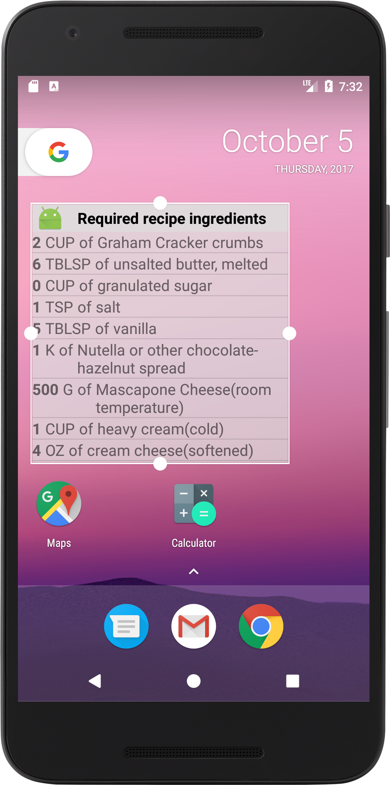

# BakingApp

Baking App allows users to select a recipe from Udacity’s resident baker-in-chief, Miriam, and see video-guided steps for how to complete it.
This is a Project 3 of [Udacity's Android Developer Nanodegree](https://www.udacity.com/course/android-developer-nanodegree-by-google--nd801).

## Features:

- Responsive UI for phones and tablets using Multi-Pane UI and fragments
- Different navigation for phones and tablets
- Show a list of recipes and recipe ingredients
- Show a list of steps required for finishing recipes
- Play videos using ExoPlayer for recipe steps if selected step has video
- Widget for displaying recipe ingredients on home screen
- Used Espresso to test aspect of the UI

## Used Libraries inside this project:

- [Gson](https://github.com/google/gson)
- [Espresso](https://developer.android.com/training/testing/espresso/index.html)
- [ExoPlayer](https://github.com/google/ExoPlayer)

## Why this Project?
As a working Android developer, you often have to create and implement apps where you are responsible for designing and planning the steps you need to take to create a production-ready app. 
Unlike Popular Movies where we gave you an implementation guide, it will be up to you to figure things out for the Baking App. 

# Screenshots:

 </img>  </img>

 </img>  
 </img>  </img>

# Developer Setup

Clone or download this repository.

## Requirements

- Java
- Latest version of Android Studio, Android Build Tools, Gradle

# Author
[Denis Dávidek](https://github.com/DenisDavidek)

